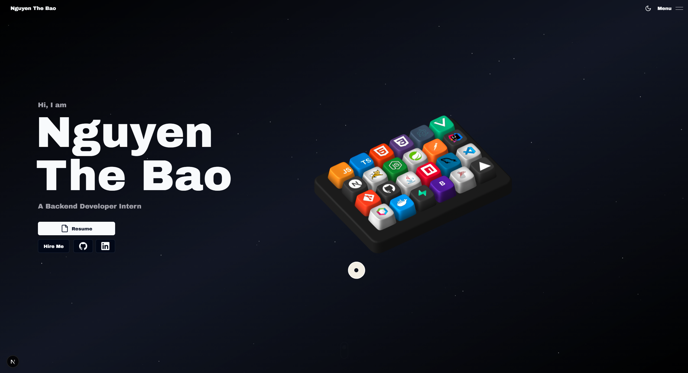

# Nguyen The Bao Portfolio

## Overview

This is the personal portfolio website of **Nguyen The Bao**, a Backend Developer Intern focused on Java, Spring Boot, SQL, and database-driven web applications.

The portfolio introduces my profile, technical skills, selected projects, resume, and contact information through an interactive 3D interface. The main visual is a Spline-powered 3D keyboard where each key represents a technology or tool used in my learning and project work.

## About Me

I am an IT student aiming to gain practical backend development experience and improve my skills in software architecture, database design, and real-world application development. My long-term goal is to become a Solution Architect.

## Highlights

- Interactive 3D keyboard for the tech stack section
- Personal profile and resume section
- Project showcase for web and desktop applications
- Contact form powered by email service integration
- Responsive layout for desktop and mobile screens
- Dark space-themed visual style with smooth animations

## Tech Stack

| Area | Technologies |
| --- | --- |
| Frontend | Next.js, React, TypeScript, Tailwind CSS |
| 3D / Animation | Spline, GSAP, Framer Motion |
| Backend Focus | Java, Spring Boot, Servlet/JSP, Jakarta EE |
| Database | SQL Server, MySQL, JDBC, Hibernate |
| Tools | Git, GitHub, Postman, IntelliJ IDEA, VS Code |

## Personal Links

- GitHub: [ngt-baor](https://github.com/ngt-baor)
- Facebook: [ngt.baor](https://facebook.com/ngt.baor)
- Portfolio: [thebao.vercel.app](https://thebao.vercel.app/)
- Instagram: [ngt_baor](https://www.instagram.com/ngt_baor)
- LinkedIn: [ngt-baor](https://linkedin.com/in/ngt-baor)
- Email: [baontph51745@gmail.com](mailto:baontph51745@gmail.com)

## Featured Projects

- **EzBook** - Java Servlet/JSP booking and management application.
- **DiscordLyrics** - Windows desktop utility built with Electron and TypeScript.
- **Messenger Desktop** - Desktop wrapper and utility features for Messenger workflows.

## Status

Project idea based on [Naresh-Khatri/3d-portfolio.git](https://github.com/Naresh-Khatri/3d-portfolio.git).
